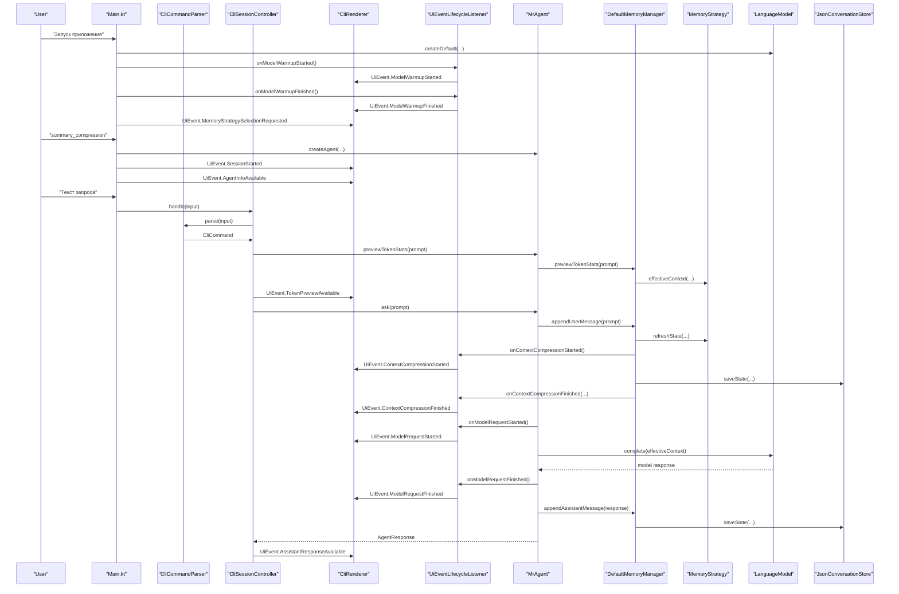
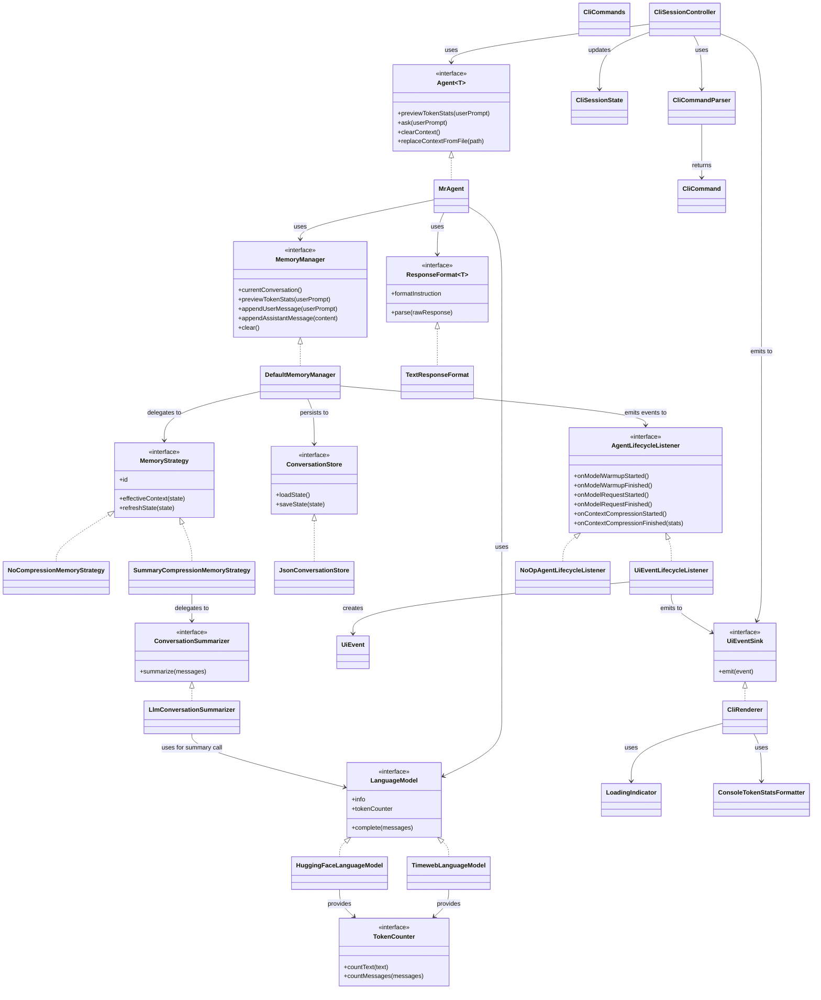

# ai_advent_day_10

CLI-агент для диалога с LLM по HTTP API с поддержкой хранения истории, выбора стратегии памяти и сжатия старого контекста через summary.

## Что умеет проект

- запускать интерактивный чат в консоли;
- переключать LLM-провайдер между `timeweb` и `huggingface`;
- сохранять историю диалога по моделям в JSON;
- выбирать стратегию памяти перед стартом чата;
- работать без сжатия истории или со сжатием через rolling summary;
- считать локальную оценку токенов до запроса;
- показывать экономию токенов после сжатия контекста.

## Быстрый старт

1. Скопируйте `config/app.properties.example` в `config/app.properties`.
2. Заполните токены для нужного провайдера.
3. Соберите и запустите проект:

```powershell
.\gradlew.bat build
.\gradlew.bat installDist
.\build\install\ai_advent_day_10\bin\ai_advent_day_10.bat
```

## Конфигурация

### Timeweb

- `AGENT_ID`
- `TIMEWEB_USER_TOKEN`

### Hugging Face

- `HF_API_TOKEN`

Если токены заданы сразу для нескольких провайдеров, по умолчанию будет выбрана первая доступная модель из списка, который строит [LanguageModelFactory.kt](/C:/Users/compadre/Downloads/Projects/AiAdvent/day_10/src/main/kotlin/llm/core/LanguageModelFactory.kt).

## Команды в чате

- `clear` — очищает контекст, оставляя системное сообщение.
- `models` — показывает доступные модели и их статус.
- `use <id>` — переключает текущую модель.
- `exit` / `quit` — завершает приложение.

## Стратегии памяти

Перед стартом чата CLI предлагает выбрать одну из стратегий памяти:

- `Без сжатия`
  Агент отправляет в модель всю сохранённую историю как есть.
- `Сжатие через summary`
  Старые сообщения сворачиваются в rolling summary, а последние сообщения остаются без изменений.

Создание стратегий централизовано в [MemoryStrategyFactory.kt](/C:/Users/compadre/Downloads/Projects/AiAdvent/day_10/src/main/kotlin/agent/memory/MemoryStrategyFactory.kt).

## Пользовательский сценарий

Ниже показано, как пользовательское действие проходит через основные части системы.



## Диаграмма классов



## Как используются программные части

### Точка входа

- [Main.kt](/C:/Users/compadre/Downloads/Projects/AiAdvent/day_10/src/main/kotlin/Main.kt)
  Выполняет bootstrap приложения, читает пользовательский ввод и передаёт его в `CliSessionController`, не обрабатывая команды напрямую.

### CLI-сессия

- [CliCommands.kt](/C:/Users/compadre/Downloads/Projects/AiAdvent/day_10/src/main/kotlin/CliCommands.kt)
  Единое место встроенных CLI-команд, используемое и в help-тексте, и в разборе ввода.
- [CliSessionState.kt](/C:/Users/compadre/Downloads/Projects/AiAdvent/day_10/src/main/kotlin/CliSessionState.kt)
  Единое состояние текущей CLI-сессии: активная модель, её id, агент и выбранная стратегия памяти.
- [CliCommandParser.kt](/C:/Users/compadre/Downloads/Projects/AiAdvent/day_10/src/main/kotlin/CliCommandParser.kt)
  Разбирает строку пользовательского ввода в типизированную команду или обычный prompt.
- [CliSessionController.kt](/C:/Users/compadre/Downloads/Projects/AiAdvent/day_10/src/main/kotlin/CliSessionController.kt)
  Исполняет команды и обычные пользовательские запросы, обновляя `CliSessionState` и эмитя `UiEvent`.

### Агент

- [MrAgent.kt](/C:/Users/compadre/Downloads/Projects/AiAdvent/day_10/src/main/kotlin/agent/impl/MrAgent.kt)
  Оркестратор одного хода диалога. Получает prompt, просит memory manager подготовить контекст, отправляет запрос в LLM и сохраняет ответ.

### Память и сжатие

- [DefaultMemoryManager.kt](/C:/Users/compadre/Downloads/Projects/AiAdvent/day_10/src/main/kotlin/agent/memory/DefaultMemoryManager.kt)
  Хранит текущее состояние памяти, сохраняет его в storage и считает токены до и после компрессии.
- [MemoryStrategy.kt](/C:/Users/compadre/Downloads/Projects/AiAdvent/day_10/src/main/kotlin/agent/memory/MemoryStrategy.kt)
  Контракт, определяющий, как формируется effective context.
- [NoCompressionMemoryStrategy.kt](/C:/Users/compadre/Downloads/Projects/AiAdvent/day_10/src/main/kotlin/agent/memory/NoCompressionMemoryStrategy.kt)
  Отдаёт всю историю без изменений.
- [SummaryCompressionMemoryStrategy.kt](/C:/Users/compadre/Downloads/Projects/AiAdvent/day_10/src/main/kotlin/agent/memory/SummaryCompressionMemoryStrategy.kt)
  Сворачивает старые сообщения в rolling summary.
- [LlmConversationSummarizer.kt](/C:/Users/compadre/Downloads/Projects/AiAdvent/day_10/src/main/kotlin/agent/memory/summarizer/LlmConversationSummarizer.kt)
  Использует LLM для построения summary старой части диалога.

### Lifecycle и CLI-статусы

- [AgentLifecycleListener.kt](/C:/Users/compadre/Downloads/Projects/AiAdvent/day_10/src/main/kotlin/agent/lifecycle/AgentLifecycleListener.kt)
  Контракт прикладных событий длительных этапов работы агента.
- [UiEventLifecycleListener.kt](/C:/Users/compadre/Downloads/Projects/AiAdvent/day_10/src/main/kotlin/agent/lifecycle/UiEventLifecycleListener.kt)
  Адаптер, который переводит lifecycle-коллбеки в typed `UiEvent`.

### Presentation-слой

- [UiEvent.kt](/C:/Users/compadre/Downloads/Projects/AiAdvent/day_10/src/main/kotlin/ui/UiEvent.kt)
  Типизированные presentation-события, описывающие, что должно быть показано пользователю.
- [UiEventSink.kt](/C:/Users/compadre/Downloads/Projects/AiAdvent/day_10/src/main/kotlin/ui/UiEventSink.kt)
  Абстракция получателя `UiEvent`, не привязанная к конкретному UI.
- [CliRenderer.kt](/C:/Users/compadre/Downloads/Projects/AiAdvent/day_10/src/main/kotlin/ui/cli/CliRenderer.kt)
  Единое место пользовательского вывода в консоли: текст, индикаторы, форматирование токенов и статусы сжатия.
- [LoadingIndicator.kt](/C:/Users/compadre/Downloads/Projects/AiAdvent/day_10/src/main/kotlin/ui/cli/LoadingIndicator.kt)
  Консольный индикатор загрузки с поддержкой вложенных статусов.
- [ConsoleTokenStatsFormatter.kt](/C:/Users/compadre/Downloads/Projects/AiAdvent/day_10/src/main/kotlin/ui/cli/ConsoleTokenStatsFormatter.kt)
  CLI-форматтер статистики токенов, используемый только внутри `CliRenderer`.

### Хранилище

- [JsonConversationStore.kt](/C:/Users/compadre/Downloads/Projects/AiAdvent/day_10/src/main/kotlin/agent/storage/JsonConversationStore.kt)
  Читает и записывает состояние памяти в `config/conversations/`.
- [ConversationMemoryState.kt](/C:/Users/compadre/Downloads/Projects/AiAdvent/day_10/src/main/kotlin/agent/storage/model/ConversationMemoryState.kt)
  JSON-модель состояния памяти на диске.

### LLM-провайдеры

- [LanguageModelFactory.kt](/C:/Users/compadre/Downloads/Projects/AiAdvent/day_10/src/main/kotlin/llm/core/LanguageModelFactory.kt)
  Создаёт провайдера по id и конфигу.
- [TimewebLanguageModel.kt](/C:/Users/compadre/Downloads/Projects/AiAdvent/day_10/src/main/kotlin/llm/timeweb/TimewebLanguageModel.kt)
  Реализация для Timeweb.
- [HuggingFaceLanguageModel.kt](/C:/Users/compadre/Downloads/Projects/AiAdvent/day_10/src/main/kotlin/llm/huggingface/HuggingFaceLanguageModel.kt)
  Реализация для Hugging Face.

### Токены

- [TokenCounter.kt](/C:/Users/compadre/Downloads/Projects/AiAdvent/day_10/src/main/kotlin/llm/core/tokenizer/TokenCounter.kt)
  Общий контракт локального подсчёта токенов.

## Как читать проект

Если хочешь быстро понять поток управления, удобнее идти в таком порядке:

1. [Main.kt](/C:/Users/compadre/Downloads/Projects/AiAdvent/day_10/src/main/kotlin/Main.kt)
2. [CliCommands.kt](/C:/Users/compadre/Downloads/Projects/AiAdvent/day_10/src/main/kotlin/CliCommands.kt)
3. [CliCommandParser.kt](/C:/Users/compadre/Downloads/Projects/AiAdvent/day_10/src/main/kotlin/CliCommandParser.kt)
4. [CliSessionController.kt](/C:/Users/compadre/Downloads/Projects/AiAdvent/day_10/src/main/kotlin/CliSessionController.kt)
5. [UiEvent.kt](/C:/Users/compadre/Downloads/Projects/AiAdvent/day_10/src/main/kotlin/ui/UiEvent.kt)
6. [CliRenderer.kt](/C:/Users/compadre/Downloads/Projects/AiAdvent/day_10/src/main/kotlin/ui/cli/CliRenderer.kt)
7. [MrAgent.kt](/C:/Users/compadre/Downloads/Projects/AiAdvent/day_10/src/main/kotlin/agent/impl/MrAgent.kt)
8. [DefaultMemoryManager.kt](/C:/Users/compadre/Downloads/Projects/AiAdvent/day_10/src/main/kotlin/agent/memory/DefaultMemoryManager.kt)
9. [MemoryStrategyFactory.kt](/C:/Users/compadre/Downloads/Projects/AiAdvent/day_10/src/main/kotlin/agent/memory/MemoryStrategyFactory.kt)
10. [SummaryCompressionMemoryStrategy.kt](/C:/Users/compadre/Downloads/Projects/AiAdvent/day_10/src/main/kotlin/agent/memory/SummaryCompressionMemoryStrategy.kt)
11. [LlmConversationSummarizer.kt](/C:/Users/compadre/Downloads/Projects/AiAdvent/day_10/src/main/kotlin/agent/memory/summarizer/LlmConversationSummarizer.kt)
12. [JsonConversationStore.kt](/C:/Users/compadre/Downloads/Projects/AiAdvent/day_10/src/main/kotlin/agent/storage/JsonConversationStore.kt)
13. [LanguageModelFactory.kt](/C:/Users/compadre/Downloads/Projects/AiAdvent/day_10/src/main/kotlin/llm/core/LanguageModelFactory.kt)

## Токены и компрессия

Во время работы CLI показывает:

- оценку токенов перед запросом;
- индикатор долгих операций;
- сообщение о сжатии контекста;
- итог после компрессии:
  `Контекст сжат: X -> Y токенов, экономия Z`

Это позволяет сравнивать режимы `Без сжатия` и `Сжатие через summary` на одном и том же пользовательском сценарии.

## Тесты

Запуск тестов:

```powershell
.\gradlew.bat test
```

Основные проверяемые области:

- фабрика моделей;
- storage и мапперы;
- стратегии памяти;
- summarizer;
- форматирование токеновой статистики;
- поведение memory manager при компрессии.

## IDE

Для навигации по коду и запуска тестов удобнее всего открыть проект в IntelliJ IDEA Community Edition.
